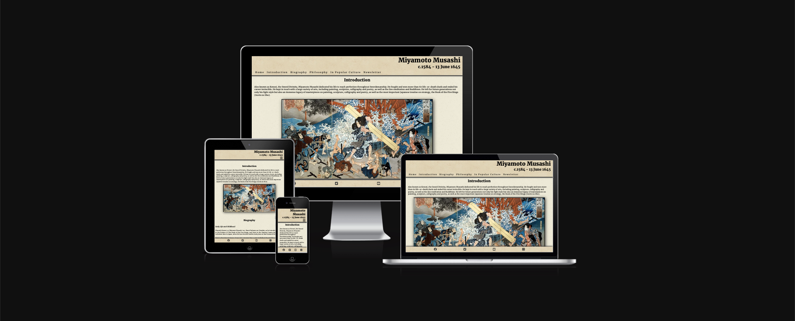
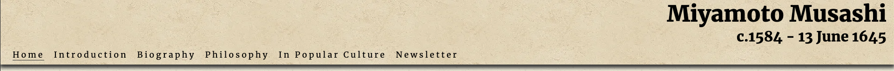
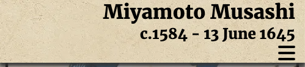
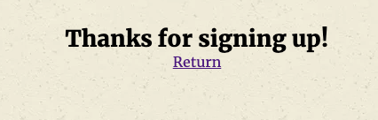

# Miyamoto Musashi - The Sword Divinity

A brief outline of the life of the legendary swordsman and philosopher Miyamoto Musashi. This website aims to educate users on important events throughout Musashi's life that contributed to his later philosophies and writing of *The Book of Five Rings*. It also includes a section about references to Musashi in popular culture including movies, anime and video games.

Find the live site [here]

[here]: https://isthatafife.github.io/Musashi-Miyamoto/

---

## Contents

* [User Experience](#user-experience-ux)
  * [User Stories](#user-stories)

* [Design](#design)
  * [Colour Scheme](#colour-scheme)
  * [Typography](#typography)
  * [Imagery](#imagery)
  * [Wireframes](#wireframes)

* [Features](#features)
  * [General Features on Each Page](#general-features-on-each-page)
  * [Future Implementations](#future-implementations)
  * [Accessibility](#accessibility)

* [Technologies Used](#technologies-used)
  * [Languages Used](#languages-used)
  * [Frameworks, Libraries & Programs Used](#frameworks-libraries--programs-used)

* [Deployment & Local Development](#deployment--local-development)
  * [Deployment](#deployment)
  * [Local Development](#local-development)
    * [How to Fork](#how-to-fork)
    * [How to Clone](#how-to-clone)

* [Testing](#testing)

* [Credits](#credits)
  * [Code Used](#code-used)
  * [Content](#content)
  * [Media](#media)
  * [Acknowledgments](#acknowledgments)

  ---

  ## User Experience (UX)

  ### Initial Discussion

  The website aims to be a clear and concise summary of Miyamoto Musashi's life, influences and philosophy for people who are interested in Japanese history, Buddhist philosophy and/or have an interest in the history of Kenjutsu.

  #### Key Areas Covered

    - Brief introduction
    - Biography of Musashi Miyamoto broken down into:
      - Early Life
      - Life as a warrior and notable duels
      - Mature Years
      - Final Years
    - Miyamoto's philosophies and how they relate to:
      - His unique sword style
      - Religion
      - Art
    - Miyamoto's influence in popular culture, including:
      - Novels
      - Movies
      - Anime
      - Manga
      - Video games
    - Users can sign up for a monthly newsletter updating them on all Musashi Miyamoto news

## User Stories

### Client Goals

- To be able to view the site on a range of device sizes.
- To make it easy for users to navigate and learn about the subject matter.
- To make the design and layout visually appealing to maintain interest.
- To allow users to sign up for the newsletter.

### First Time Visitor Goals

- I want to quickly and clearly find out what the site is about.
- I want to be able to navigate the site easily.
- I want to be able to learn as much as I can about the subject matter.
- I want to be able to sign up for a newsletter in order to stay updated.

### Returning Visitor Goals

- I want to refresh my knowledge of the subject matter.
- I want to use the website as research.

---

## Design

The website is aimed towards a "historical" look, almost as if printed on parchment paper. This is achieved with the pale tan colouring and textures added to the header and main body backgrounds.

### Typography

Google Fonts was used for the following fonts:

  - Merriweather is used for headings and content on the site. It is a serif font.

### Imagery

Imagery will consist mainly of historical woodblock prints with some photos of modern-day statues of Miyamoto Musashi.

### Wireframes

Wireframes were created for mobile and desktop.

[Mobile]

[Desktop]

[Mobile]: docs/wireframes/mm-wireframe-1.png
[Desktop]: docs/wireframes/mm-wireframe-2.png

## Features

The website has two pages: the main page containing all information under separate headings which are accessible through a navbar at the top of the page. The second page is a thank you page displayed after users have signed up for the newsletter using the form on the main page. It also includes a return button to return users to the main page.

- The main page has:
  - A responsive navbar at the top allowing users to quickly navigate the page. To allow good UX, the menu items are replaced with a "burger button" using media queries for users on mobile devices.

  

  

  - A footer that includes links to all major social medias.

  

- The thank you page has:
  - A return button to allow users to return to the main page after signing up.

  

- Future implementations:
  - An events calendar to showcase any events relating to Musashi Miyamoto (Lectures, movie screenings, etc.)

## Accessibility

I have been mindful during coding to ensure that the website is as accessible friendly as possible. I have achieved this by:

  - Using semantic HTML.
  - Using descriptive alt attributes on images on the site.
  - Providing information for screen readers where there are icons used and no text - such as the footer icons.
  - Ensuring that there is a sufficient colour contrast throughout the site.
  - Ensuring that all sections of the main page are easily accessible at all times by making the header navbar stick to the top of the page while users scroll.

  ---

  ## Technologies Used

  ### Languages Used

  HTML5 and CSS were used to create this website, with JavaScript used for some menu functionality.

  ### Frameworks, Libraries & Programs Used

  Balsamiq - Used to create wireframes.

  Git - For version control.

  Github - To save and store the files for the website.

  Google Fonts - To import the fonts used on the website.

  Font Awesome - For the iconography on the website.

  Google Dev Tools - To troubleshoot and test features, solve issues with responsiveness and styling.

  Affinity Photo - To edit the alpha channel of certain images used on the website.

  [Tiny PNG](https://tinypng.com/) To compress images.

  [Pixlied](https://pixelied.com) To convert images to webp format.

  [Favicon.io](https://favicon.io/) To create favicon.

  [Am I Responsive?](http://ami.responsivedesign.is/) To show the website image on a range of devices.

  Responsive Image Linter - To optimise image sizing.

  ---

## Deployment & Local Development

### Deployment

Github Pages was used to deploy the live website. The instructions to achieve this are below:

1. Log in (or sign up) to Github.
2. Find the repository for this project, Musashi-Miyamoto.
3. Click on the Settings link.
4. Click on the Pages link in the left hand side navigation bar.
5. In the Source section, choose main from the drop down select branch menu. Select Root from the drop down select folder menu.
6. Click Save. Your live Github Pages site is now deployed at the URL shown.

### Local Development

#### How to Fork

To fork the Musashi-Miyamoto repository:

1. Log in (or sign up) to Github.
2. Go to the repository for this project, isthatafife/Musashi-Miyamoto.
3. Click the Fork button in the top right corner.

#### How to Clone

To clone the Musashi-Miyamoto repository:

1. Log in (or sign up) to GitHub.
2. Go to the repository for this project, isthatafife/Musashi-Miyamoto.
3. Click on the code button, select whether you would like to clone with HTTPS, SSH or GitHub CLI and copy the link shown.
4. Open the terminal in your code editor and change the current working directory to the location you want to use for the cloned directory.
5. Type 'git clone' into the terminal and then paste the link you copied in step 3. Press enter.

- - -

## Testing

Testing was ongoing throughout the entire build of the website. I used Chrome developer tools extensively during development to troubleshoot issues.

### W3C Validator

[Index Page HTML](docs/testing/validator/w3c-index.png)

[Signup Page HTML](docs/testing/validator/w3c-signup.png)

[Index and Signup CSS](docs/testing/validator/w3c-css.png)

### Solved Bugs

1. On some screen sizes the header would overlap with the content meant to be displayed at the top of the screen. I found a thread on Stack Overflow that recommended adding a transparent border the same size as the header to the top of each of my sections. This seemed to fix the issue.
2. On mobile devices the navbar menu would remain on screen after users clicked a link. I implemented the JavaScript file menu.js to fix this and make the menu disappear on user clicking a link.

### Known Bugs

No known bugs at the moment.

### Testing User Stories

  First Time Visitor Goals

- I want to quickly and clearly find out what the site is about.
    - The introduction section is the first thing users see and gives a brief but clear overview of the purpose of the site.
- I want to be able to navigate the site easily.
    - The navbar is visible at the top of the page at all times, allowing users to access every section no matter where they are on the page.
- I want to be able to learn as much as I can about the subject matter.
    - The biography section follows the life of the subject from early age until death and includes all important recorded events throughout his life.
- I want to be able to sign up for a newsletter in order to stay updated.
    - There is a very simple form on the main page to allow users to sign up for the newsletter.

### Returning Visitor Goals

- I want to refresh my knowledge of the subject matter.
    - The navbar allows users to quickly access the specific information they are looking for, so return visitors will not have to search or scroll very far for the information they are looking for.
- I want to use the website as research.
    - All information is taken from reputable sources and a list of references can be found in the credits section of this document.

### Lighthouse

I used Lighthouse within the Chrome Developer Tools to allow me to test the performance, accessibility, best practices and SEO of the website.

#### Main Page

[Lighthouse Testing for Desktop Main Page - Test 1](docs/testing/lighthouse/mm-lighthousedesktopreport.pdf)

[Lighthouse Testing for Mobile Main Page - Test 1](docs/testing/lighthouse/mm-lighthousemobilereport.pdf)

#### Thank You Page

[Lighthouse Testing for Desktop Thank You Page - Test 1](docs/testing/lighthouse/thanks-lighthousedesktopreport.pdf)

[Lighthouse Testing for Mobile Thank You Page - Test 1](docs/testing/lighthouse/thanks-lighthousemobilereport.pdf)

### Full Testing

To fully test my website I performed the following testing using a number of browsers (Chrome, Safari, Mozilla Firefox, Duckduckgo) and devices (Mac Studio M1 Ultra, Macbook Pro 16", OnePlus 10 Android phone, iPhone 13 pro).

I also viewed both pages in Chrome developer tools to ensure they were responsive on all screen sizes.

#### Links

1. Test each link on the main page. Each link worked as expected, and any links leading to external pages opened correctly in a seperate browser tab.
2. Test "Return" link on Thank You page. Link worked as expected and returned the browser to the main page in the same browser tab.

#### Newsletter Form

1. Test the sign up form. I tried to submit the form without filling in any input fields. The form worked correctly and directed users to fill in the first name field. I then filled in the first name field and tried to submit the form. Again the form worked correctly and directed the user to fill out the last name field. I filled out the first and last name forms and tried to submit the form. The form worked correctly and asked the user to fill in the email field. I filled out the first name, last name and email field and tried to submit the form. The form then opens the thank you page in the same browser window.
2. I tried to submit the form with only an email address - the form directs the user to fill in the first name field. I filled out the first name and email fields and tried to submit the form. The form then directs the user to fill out the last name field. I filled in the first name, email and last name field and submitted the form. The form then opens the thank you page in the same browser window.
3. I tried to submit the form with just the last name field filled in and the form directed me to fill in the first name field. I filled in the last name and email fields and tried again to submit. The form asks the user to fill in the first name field. I filled out the first name, last name and email fields and submitted the form. the form then opens the thank you page in the same browser window.
4. I tried to submit the form with only the textarea field filled in. The form directs the user to fill in the name field. I filled in the name and textarea field and submitted the form. The form directs the user to fill in the email field. I filled in the name, email and textarea fields and submitted the form. The form then opens the thank you page in the same browser window.
5. I tried submitting the form without any information filled in. The form directs the user to fill in the first name field. It then goes on to ask the user to complete the last name and email fields if they are not filled out. The form can then be submitted and will open the thank you page in the same browser window.

---

## Credits

### Code Used

Form contents and footer code used on main page taken from [Love Running Project](https://github.com/isThatAFife/Love_Running)

Javascript for burger menu found on [Stack Overflow](https://stackoverflow.com/questions/58193096/how-do-i-close-this-checkbox-menu-after-the-user-clicks-on-the-links-or-outside)

Srcset ideal image sizes supplied by [Responsive Image Linter](https://chromewebstore.google.com/detail/responsive-image-linter/mnddginionlghpblkimpdalcecpnbjln)

### Content

Biographical content taken from [Niten](http://www.niten.org/english/instituto/miyamoto_musashi/musashi-biografia), [Britannica](https://www.britannica.com/biography/Miyamoto-Musashi-Japanese-soldier-artist) and [Wikipedia](https://en.wikipedia.org/wiki/Miyamoto_Musashi).

Philosophy content taken from [Niten](http://www.niten.org/english/instituto/miyamoto_musashi/musashi-biografia) and [The Book of Five Rings](https://amzn.eu/d/85dSdC0)

### Media

Images found on [Niten](http://www.niten.org/english/instituto/miyamoto_musashi/musashi-biografia), [Wikipedia](https://en.wikipedia.org/wiki/Miyamoto_Musashi) and [Japan Travel](https://en.japantravel.com/kumamoto/musashizuka-park/15210). Thank You Page image taken from [Vagabond, by Takehiko Inoue](https://en.wikipedia.org/wiki/Vagabond_(manga))

### Acknowledgements

I would like to thank the following people who helped me along the way in completing my first milestone project:

[Lauren-Nicole Popich](https://github.com/CluelessBiker) - My Code Institute mentor
[Peter Neumann](https://github.com/peter-neumann-dev) - Creator of responsive image linter, which was a huge help in improving the site performance
Ai Okuyama - For helping me test the website on various devices
